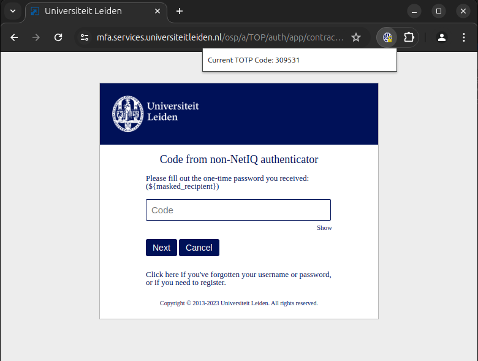
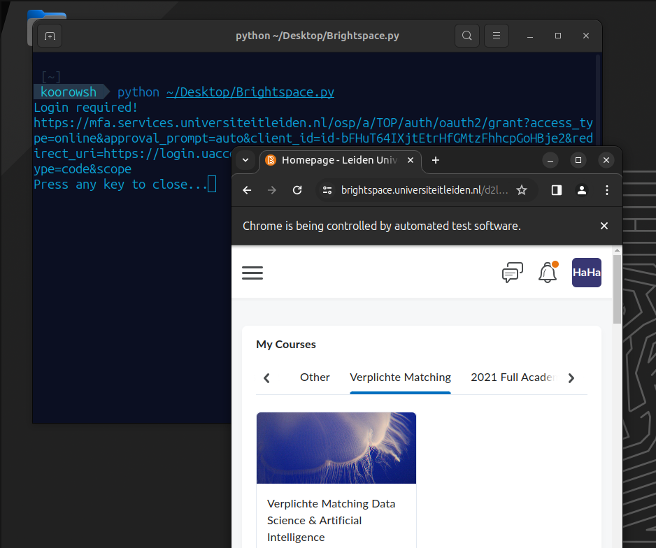

# AutoULCN

In this open-source project, we aim to implement a swift and secure two-step verification auto-filler for Leiden University Login Web pages.


## Solutions
- Browser Extention to auto-fill Credentials
- Python script to load Brightspace Logged-in
- TOTP (6-digit code) Generator web-based
- Bash TOTP Generator with a keyboard shortcut
- What else? You say ...

## How to start?

We use the Non-NetIQ Authentication method to gain access to your Secret_Key to be able to generate and auto-fill the 6-digit key called TOTP (Time-based one-time password)

Keep in mind the first step would be the hardest so keep an eye on the documentation and videos.

### Step 1
Log in and gain access to [Account service]("https://account.services.universiteitleiden.nl/") and select 'Multi-Factor Authentication'.


### Step 2
Enroll or Modify for 'Non-NetIQ Authenticator'

The story is about the QR-Code in front of you, your Secret_Key is embedded in this QR so you can Extract the key via
- 'AutoULCN Key_extractor' available from the above directories
- Manually extracting the key by [Qr-Reader]("https://scanqr.org/#scan") and you can find your secret key in the following format:
```
otpauth://totp/Leiden%20University:UL%5Cs**Student Number**?secret=**Secret_Key**&issuer=Leiden+University
```
As a backup always use a Third-Party authenticator as well like:
- [Google Authenticator]("https://github.com/google/google-authenticator") 
- [Microsoft Authenticator]("https://www.microsoft.com/en-us/security/mobile-authenticator-app")

### Step 3
After setting up this authentication method by entering your generated TOTP we are ready to use AutoULCN

### Step 4

Now choose your prefered AutoULCN Method from the directories above:

- **Chrome Extention**: An initial local version of extention that will locally store your secret_key for generating and copying the TOTP code



- **Brightspace**: A python script that runnig selenium and auto-filling your



- **Bash Script**: Install totp generator as bash script on your shell

 

## Contribution

You're always welcomed to send pull requests by Forking Repository and adding a new feature or help fixing the code issues.