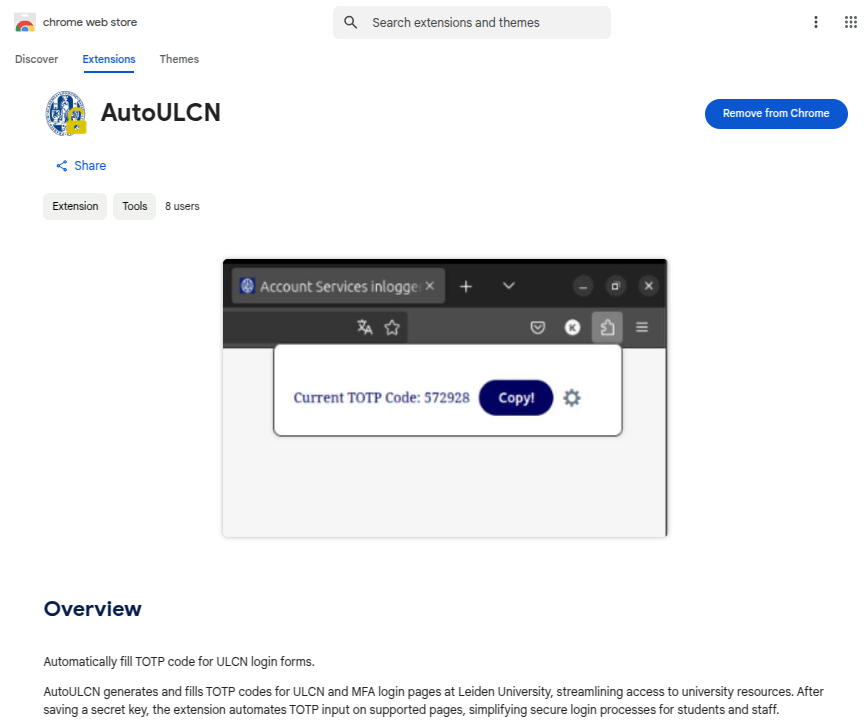
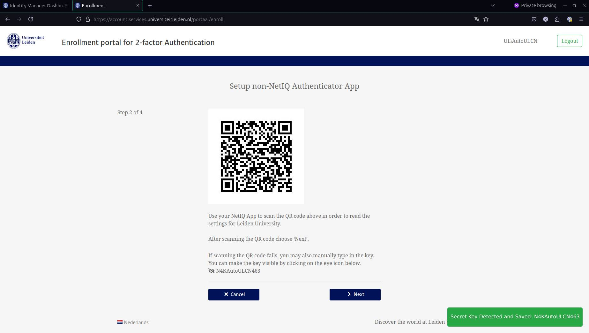

# AutoULCN

In this open-source project, we aim to implement a swift and secure two-step verification auto-filler for Leiden University Login Web pages.

## Solutions
- Browser Extention to auto-fill Credentials
- Python script to load Brightspace Logged-in
- TOTP (6-digit code) Generator web-based
- Bash TOTP Generator with a keyboard shortcut
- What else? You say ...

## How to start?

### Setup Video

Click <a href="https://youtu.be/52kdsJtcGTY">here</a> to watch setup tutorial video

### Setup Guide

We use the Non-NetIQ Authentication method to gain access to your Secret_Key to be able to generate and auto-fill the 6-digit key called TOTP (Time-based one-time password)

Keep in mind the first step would be the hardest so keep an eye on the documentation and videos.

### Step 1
Install and Enable the AutoULCN Extention

### Step 2
Log in and gain access to <a href="https://account.services.universiteitleiden.nl/">Account service</a> and select 'Multi-Factor Authentication'.

### Step 3
Fill in the credentials and Enroll or Modify for 'Non-NetIQ Authenticator'

In this page you will face a Qr-Code which is highly recommended to scan using a Third-Party Authenticator like Google Authenticator or Microsoft Authenticator.
- <a href="https://support.google.com/accounts/answer/1066447?sjid=12195718344365625202-EU">Google Authenticator</a>
- <a href="https://www.microsoft.com/en-us/security/mobile-authenticator-app">Microsoft Authenticator</a>

Your secret key which generated by the university will be shown in the page, copy this key and keep it safe as this string will be used to generate the TOTP code.

`AutoULCN will turn this Secret Key into a 6-digit code and auto-fill the code in the login page.`

The key will appear when you click on eye icon (👁️). The AutoULCN extension will be enabled as soon as it detects the visible Secret Key String on your screen.

### Step 3
After setting up this authentication method by entering your generated TOTP we are ready to use AutoULCN!

### Project Solutions
AutoULCN can be accessed using different methods, for which you can find instructions in their respective repository directories, such as:

- **Chrome Extention**: An initial local version of the extension that will locally store your secret_key for generating and copying the TOTP code

- **AutoBrightspace**: A Python script that running Selenium and auto-filling your credentials and TOTP code to log in to Brightspace

- **Bash Script**: ToTP code generator using a bash script with a keyboard shortcut

 

## Contribution

You're always welcome to send pull requests by Forking Repository and add a new feature or help fix the code issues.